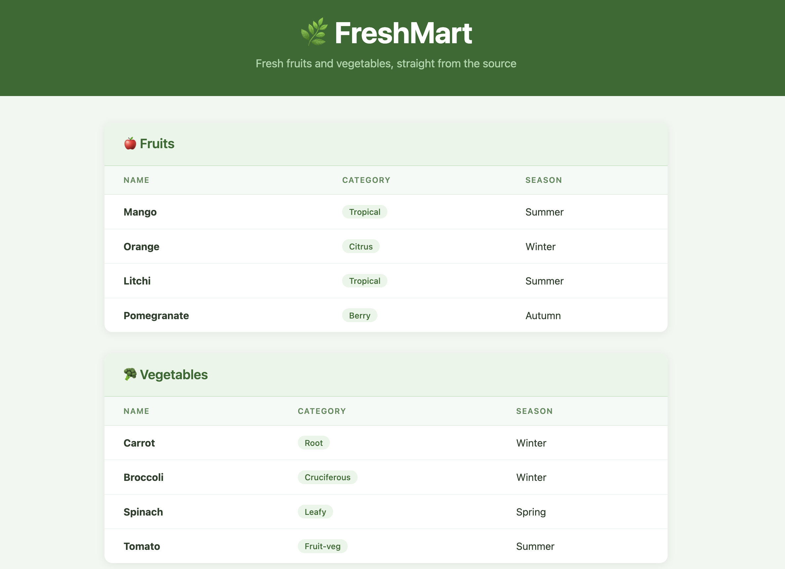
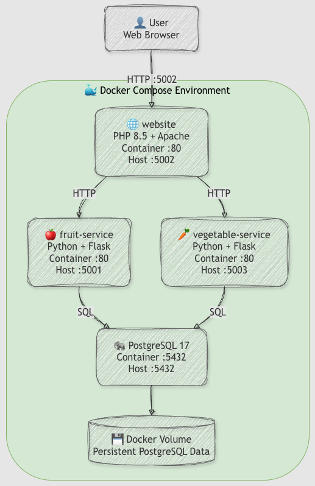

# 🌿 FreshMart


> A containerized microservices application built with Flask, PHP, PostgreSQL, Docker Compose, and GitHub Actions.

---

## 📸 Preview



---

## 🏗️ Architecture

FreshMart consists of a PHP frontend, two Flask REST services, and a PostgreSQL database running with Docker Compose.



### Services

| Service | Technology | Role | Host Port | Container Port |
|---|---|---|---:|---:|
| `website` | PHP 8.5 + Apache | Frontend | 5002 | 80 |
| `fruit-service` | Python + Flask | Fruit REST API | 5001 | 80 |
| `vegetable-service` | Python + Flask | Vegetable REST API | 5003 | 80 |
| `db` | PostgreSQL 17 | Database | 5432 | 5432 |

> Each application container listens on port `80` internally. Docker maps these to different host ports (`5001`, `5002`, and `5003`).

---

## 📁 Project Structure

```text
FreshMartApp/
├── .github/
│   └── workflows/
│       └── ci.yml
├── db/
│   ├── 01-schema.sql
│   ├── 02-fruits.sql
│   └── 03-vegetables.sql
├── product/
│   ├── Dockerfile
│   ├── api.py
│   └── requirements.txt
├── vegetable/
│   ├── Dockerfile
│   ├── api.py
│   └── requirements.txt
├── website/
│   └── index.php
├── docker-compose.yml
└── README.md
```

---

## 🚀 Run Locally

### Prerequisites

- Docker Desktop
- Git

### 1. Clone the repository

```bash
git clone https://github.com/FireAMS/FreshMartApp.git
cd FreshMartApp
```

### 2. Start the application

```bash
docker compose up --build
```

### 3. Access the services

| Service | URL |
|---|---|
| 🌿 Website | http://localhost:5002 |
| 🍎 Fruit API | http://localhost:5001/ |
| 🥕 Vegetable API | http://localhost:5003/vegetables |

### 4. Stop the application

```bash
docker compose down
```

PostgreSQL is initialized from the SQL scripts in `db/` on the first database startup, and data is persisted using a Docker volume.

---

## ⚙️ CI/CD

GitHub Actions runs automatically on pushes and pull requests targeting `master`.

The CI workflow:

1. Checks out the repository
2. Builds the Docker Compose services
3. Starts the containers
4. Tests the Fruit and Vegetable APIs with `curl`
5. Stops the containers

On a successful push to `master`, the workflow also builds and publishes the Fruit and Vegetable Docker images to Docker Hub.

---

## 🐳 Docker Hub

- [Fruit Service](https://hub.docker.com/r/fireams/fruit-service)
- [Vegetable Service](https://hub.docker.com/r/fireams/vegetable-service)

---

## 🔮 Next Steps

- Kubernetes deployment
- Infrastructure with Terraform
- Cloud deployment

---

## 👩‍💻 Author

**Audrey**

- GitHub: https://github.com/FireAMS

---

*FreshMart — Flask • PHP • PostgreSQL • Docker Compose*